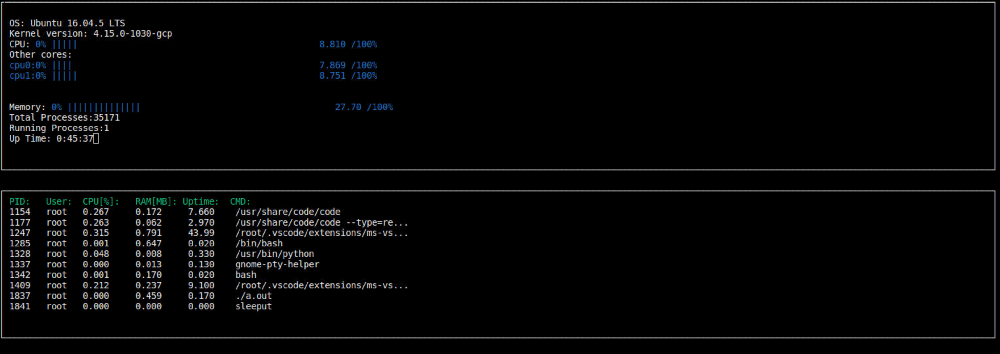

# System-Monitor

Should be able to work with `FreeBSD` and `Ubuntu` system. <br/>
*Not be tested in other Linux environment yet.*




## Execution

1. Clone repository

2. Install `ncurses` package
```
sudo apt-get install libncurses5-dev libncursesw5-dev
```
4. Compile and run
```
g++ -std="c++17" main.cpp -lncurses
./a.out
```
